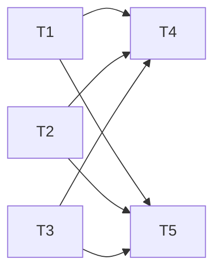

# TASK_AnchorNavA11y

- 版本: v1.0
- 阶段: 6A-Stage3 Atomize / 第一步：子任务拆分

## 任务总览

- 目标：实现首页锚点导航的无障碍支持、平滑滚动、状态高亮与键盘可达性。
- 原则：不破坏现有架构与样式体系，
  不新增运行时依赖。

## 原子任务列表

### T1: 全局滚动行为与减少动态兜底（globals.css）

- 输入契约：
  - 依赖：`globals.css` 存在。
- 输出契约：
  - `html { scroll-behavior: smooth; }` 生效；
  - 媒体查询兜底生效：

    ```css
    @media (prefers-reduced-motion: reduce) {
      html { scroll-behavior: auto; }
    }
    ```

  - 非嵌套在 `body` 选择器内。
- 实现约束：遵循 CSS 与 Tailwind 并存策略。
- 依赖关系：无（可先行）。
- 验收标准：
  - 在支持平滑滚动的浏览器中生效；
  - 将系统设为“减少动态”时，滚动行为为瞬时。

### T2: NavDock 导航项与键盘触发（Enter/Space）

- 输入契约：
  - 依赖：现有 NavDock 组件。
- 输出契约：
  - 导航项可通过 Enter/Space 触发与点击一致的行为；
  - 当前项渲染 `aria-current`。
- 实现约束：事件处理需 SSR 安全、无内存泄漏。
- 依赖关系：T1 完成后执行（可并行）。
- 验收标准：
  - 手测点击与按键触发一致；
  - 屏幕阅读器可读。

### T3: `#about` 目标区块可聚焦与焦点管理

- 输入契约：
  - 依赖：`ProductHighlights` 提供 `<section id="about">`。
- 输出契约：
  - 平滑滚动到达后将焦点移至 `#about` 或其标题；
  - `section` 具备 `tabIndex={-1}` 与语义关联。
- 实现约束：避免视觉跳动，处理重复导航。
- 依赖关系：T1 完成后执行。
- 验收标准：
  - 焦点可见、可通过键盘返回导航。

### T4: 自动化截图与可视回归

- 输入契约：
  - 依赖：本地可访问地址 `http://localhost:3004/`；
  - 环境：Puppeteer/浏览器自动化能力可用。
- 输出契约：
  - 1440x900 分辨率下捕获 `/` 与 `/#about` 截图；
  - 与基线对比（首次作为基线，后续回归比较差异）。
- 实现约束：
  - 截图命名规范：`home-*.png`、`about-*.png` 或工具内名称标识；
  - 不引入重型依赖（优先复用现有能力）。
- 依赖关系：T1/T2/T3 完成后执行。
- 验收标准：
  - 成功产出两张截图；
  - 二次运行可对比差异，差异阈值可配置。

### T5: 可访问性与键盘可达性验证

- 输入契约：
  - 依赖：NavDock、ProductHighlights 改造生效；
  - 环境：浏览器端可交互。
- 输出契约：
  - Enter/Space 行为等同点击；
  - `aria-current` 正确渲染；
  - Skip Link 定位主内容并可见（焦点样式明显）。
- 实现约束：
  - 不破坏原有视觉样式；
  - 符合 WAI-ARIA 基本规范。
- 依赖关系：T1/T2/T3 完成后执行。
- 验收标准：
  - 通过手测与 Axe/Lighthouse 无严重问题；
  - 键盘无障碍路径完整可用。

## 任务依赖图（Mermaid）


